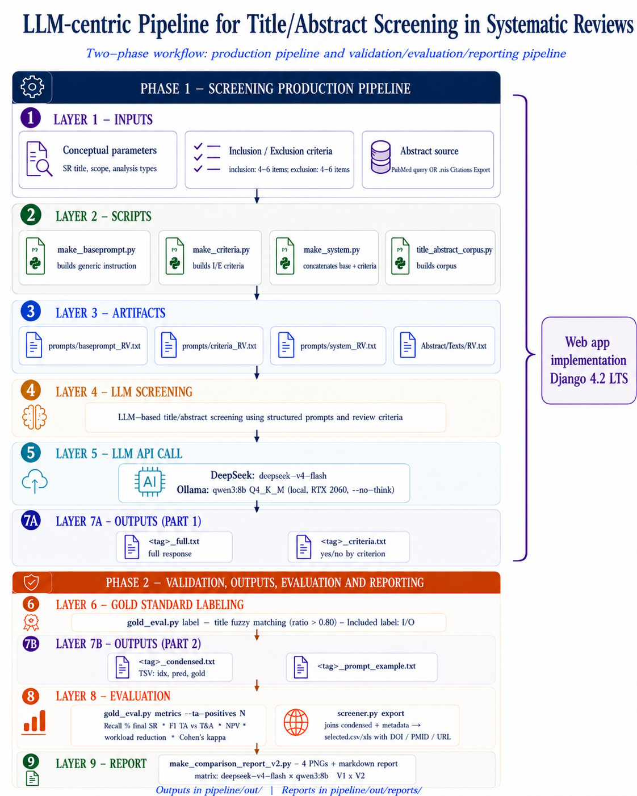

# LLM Abstract Screening

An open-source, **single-LLM** pipeline for **Title/Abstract (T&A) screening** in systematic
reviews, with a command-line pipeline **and** a local **Django web application**
(*human-in-the-loop*). It classifies abstracts against inclusion/exclusion criteria using
large language models and evaluates them against a gold standard.

Project developed during the course of Clinical Information Management for an MSc Degree in Clinical Bioinformatics,replicating the design of Li *et al.* (2024) in a minimal, reproducible single-LLM form.

## Features

- **4 providers behind one interface:** OpenAI (GPT-4o), DeepSeek (V4-Flash), Groq (Llama 3.3),
  and **Ollama** for a fully local model (Qwen3, no API key, zero cost).
- **Two prompt structures:** V1 (single *user* message, Li 2024) and V2 (*system* + *user*,
  Dennstädt 2024).
- **Dual gold-standard evaluation:** recall against the finally-included articles **and**
  F1 at the Title/Abstract level.
- **Metrics:** recall, precision, F1, specificity, NPV, Cohen's κ, workload reduction.
- **Web app:** project setup, corpus by PubMed query **or** file upload (.txt/.csv/.xlsx),
  background screening with a live progress bar, human review with per-record override,
  and CSV/XLSX export.

## Workflow



## Repository structure

```
llm-abstract-screening/
├── pipeline/                  # command-line pipeline
│   ├── screening_core.py      # shared core: prompts (V1/V2), providers, parser, PubMed
│   ├── screener.py            # extract | screen | export (multi-mode CLI)
│   ├── screener_2txt.py       # V2 screener (system + user)
│   ├── screener_3txt.py       # V1 screener (single user message)
│   ├── gold_eval.py           # label gold standard + compute metrics
│   ├── prep/                  # build prompts/criteria/system + corpus import
│   ├── prompts/               # baseprompt_/criteria_/system_ per review
│   ├── AbstractTexts/         # corpora (Title/Abstract/Label Included)
│   └── .env.example           # API-key template (copy to .env)
├── webapp/                    # Django web interface (local, single-user)
│   ├── manage.py
│   ├── config/                # Django settings/urls/wsgi
│   └── screening/             # app: models, views, worker, templates, static
├── docs/
│   └── workflow.png           # architecture diagram
├── requirements.txt           # all dependencies (pipeline + web app)
└── README.md
```

## Requirements

- **Python 3.9 to 3.12** (Django 4.2 LTS is pinned for 3.9 compatibility).
- Dependencies in `requirements.txt` (Django, openai, pandas, scikit-learn, …).
- **Optional:** [Ollama](https://ollama.com) for the local Qwen3 model (`ollama pull qwen3:8b`),
  which needs **no API key**.

## Setup

```bash
git clone https://github.com/goncalofebra/llm-abstract-screening.git
cd llm-abstract-screening

python -m venv .venv
# Windows:        .venv\Scripts\activate
# macOS / Linux:  source .venv/bin/activate

pip install -r requirements.txt
```

**API keys (cloud providers only).** Copy the template and add the keys you have:

```bash
cp pipeline/.env.example pipeline/.env     # Windows: copy pipeline\.env.example pipeline\.env
# edit pipeline/.env and set OPENAI_API_KEY / DEEPSEEK_API_KEY / GROQ_API_KEY
```

The local model (Ollama / Qwen3) needs no key. In the web app, keys can also be set on the
**Settings** page (which writes to `pipeline/.env`).

## Command-line pipeline

Run from inside the `pipeline/` folder. Example for review **RV3**:

```bash
cd pipeline

# 1. (optional) Extract abstracts from PubMed -> AbstractTexts/RV3.txt
python screener.py extract --out ../data/pubmed.csv \
    --abstract-txt AbstractTexts/RV3.txt --from-year 2016 --to-year 2020 --max-results 2000

# 2. Mark the gold standard (titles included by the original review)
python gold_eval.py label --input AbstractTexts/RV3.txt --output AbstractTexts/RV3.txt \
    --titles-file <included_titles.txt>

# 3. Screen (DeepSeek cloud)
python screener.py screen --input AbstractTexts/RV3.txt --system prompts/system_RV3.txt \
    --tag RV3 --provider deepseek --no-think
#    ...or fully local with Ollama:
python screener.py screen --input AbstractTexts/RV3.txt --system prompts/system_RV3.txt \
    --tag RV3_qwen3 --provider ollama --model qwen3:8b --no-think --sleep 0 --max-tokens 100

# 4. Metrics (F1 at the Title/Abstract level; N = T&A positives, e.g. 81 for RV3)
python gold_eval.py metrics --condensed out/RV3_condensed.txt --tag RV3 --ta-positives 81

# 5. Export the selected articles with DOIs
python screener.py export --metadata ../data/pubmed.csv \
    --abstracts AbstractTexts/RV3.txt --condensed out/RV3_condensed.txt --tag RV3
```

`--dry-run` on `screen` writes only `out/<tag>_prompt_example.txt` for inspection (no LLM call).

## Web application

```bash
cd webapp
python manage.py migrate          # first run only (creates db.sqlite3)
python manage.py runserver
```

Open **http://localhost:8000**. Then:

1. **New project** — name, base prompt, inclusion/exclusion criteria, prompt structure, model.
2. **Populate the corpus** — run a PubMed query in the interface, or upload `.txt`/`.csv`/`.xlsx`.
3. **Run screening** — pick provider/model and start; a background worker shows live progress.
4. **Review** — confirm or override each decision (includes highlighted).
5. **Export** — download the confirmed inclusion list (CSV/XLSX).

See `webapp/README.md` for details.

## Providers

| `--provider` | Env var | Default model | Notes |
|---|---|---|---|
| `openai`   | `OPENAI_API_KEY`   | `gpt-4o-2024-11-20`        | cloud |
| `deepseek` | `DEEPSEEK_API_KEY` | `deepseek-v4-flash`       | cloud, low cost |
| `groq`     | `GROQ_API_KEY`     | `llama-3.3-70b-versatile` | cloud, free tier |
| `ollama`   | (none)             | `qwen3:8b`                | **local**, needs `ollama serve` |

## Notes

- The web app is a **local, single-user** tool (`DEBUG=True`, SQLite, no authentication).
  Do not expose it on the internet without hardening (auth, `DEBUG=False`, a fresh `SECRET_KEY`).
- For binary yes/no tasks always pass `--no-think` (disables reasoning; ~10x faster).
- The corpora in `AbstractTexts/` use the format `Title:` / `Abstract:` / `Label Included: 0|1`.

## Authors & Contributions

*   **Miguel Alves** ([@mpalvees](https://github.com/mpalvees)) — Conceptualisation of the study, pipeline architecture design, overall implementation, and project documentation.
*   **Gonçalo Bernardo** ([@goncalofebra](https://github.com/goncalofebra)) — Development of the entire codebase, implementation of the screening pipeline, the local web application, and contribution to the final manuscript.
*   **Júlia Gonçalves**, **Alexandra Rodrigues**, & **André Oliveira** — Substantial contribution to the writing of the manuscript, curation of the review datasets, and elaboration of the systematic reviews used for validation.

---
*All authors critically reviewed and approved the final version of the project.*

The complete scientific paper detailing the methodology, replication design, and results can be accessed here:
**[Download Project Paper (PDF)](./Final_Manuscript.pdf)**

## License

MIT — see [LICENSE](LICENSE).
